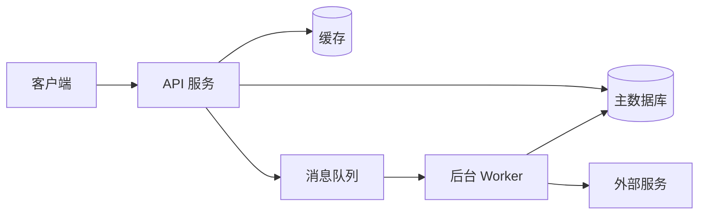

# 系统架构

## 总览图

## 模块划分

| 模块     | 职责                       | 主要依赖 |
| -------- | -------------------------- | -------- |
| client   | 用户交互                   | API      |
| api      | HTTP 接口、鉴权、参数校验  | DB、缓存 |
| worker   | 异步任务、定时任务         | MQ、DB   |
| infra    | 部署、监控、日志           | —        |

## 部署拓扑

- 环境：dev / staging / prod
- 主机：
- CDN：
- 数据库主从 / 备份策略：

## 横切关注点

- **鉴权**：（如 JWT、Session）
- **日志**：结构化 JSON 日志，落地到 ……
- **监控**：（如 Prometheus + Grafana）
- **错误追踪**：（如 Sentry）
- **配置管理**：环境变量 / 配置中心

## 重大决策记录（ADR）

| #   | 决策                  | 日期       | 理由                     |
| --- | --------------------- | ---------- | ------------------------ |
| 1   | 前端选择 React 而非 Vue | YYYY-MM-DD | 团队熟悉度 + 生态丰富   |
