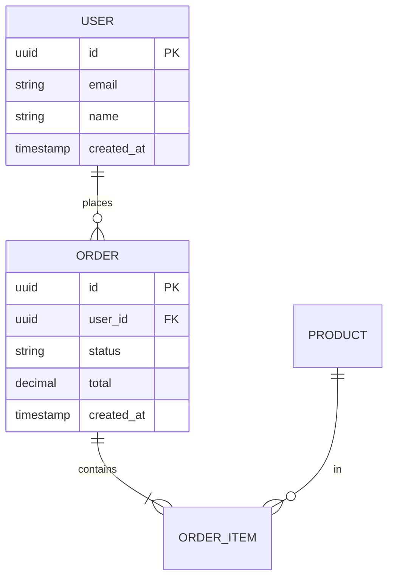

# 数据模型

## ER 图

## 表结构

### user

| 字段        | 类型         | 约束         | 说明 |
| ----------- | ------------ | ------------ | ---- |
| id          | uuid         | PK           |      |
| email       | varchar(255) | UNIQUE NN    |      |
| created_at  | timestamptz  | NN DEFAULT now() |  |

**索引**：email UNIQUE

### order

| 字段     | 类型 | 约束 | 说明 |
| -------- | ---- | ---- | ---- |
|          |      |      |      |

## 数据规模预估

| 表     | 1 年后预估行数 | 增长速率 |
| ------ | -------------- | -------- |
| user   |                |          |
| order  |                |          |

## 数据迁移策略

- 初始化：……
- 版本升级：使用迁移工具（如 Prisma / Flyway / Alembic）
- 备份：……
