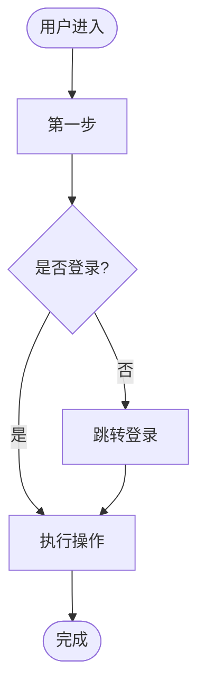

# UX 流程

## 主流程：（流程名）

```mermaid
flowchart TD
    Start([用户进入]) --> A[第一步]
    A --> B{是否登录?}
    B -- 是 --> C[执行操作]
    B -- 否 --> D[跳转登录]
    D --> C
    C --> End([完成])
```

### 步骤说明

1. ……
2. ……

### 异常路径

- 网络断开：
- 操作超时：
- 权限不足：

---

## 次要流程

（同上结构）
